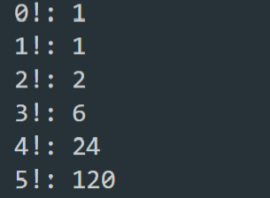
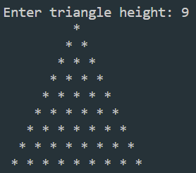

# 2. Hafta Ödevleri

## 1. Odev

0'dan başlayarak belirli bir sayıya kadar tüm sayıların faktöriyel değerlerini ekrana yazdıran bir program yazınız.

## 2. Odev

Alt kenardaki yıldız sayısını girdi olarak aldıktan sonra aşağıdaki gibi üçgenleri döngüler kullanarak ekrana bastıran bir program yazınız.

## 3. Odev

Belirli bir aralıkdaki tüm asal sayıları hesaplayan ve ekrana bastıran bir program yazınız.
Örneğin kullanıcıdan son sayıyı girdi olarak alın ve 2'den başlayarak o sayıya kadar tüm asal sayıları ekrana bastırın.
